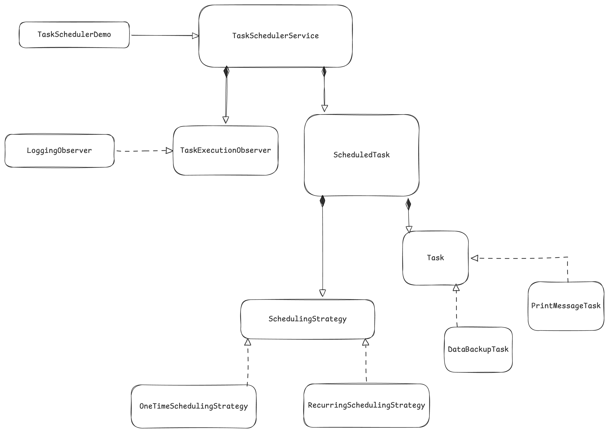

# Task Scheduler

1. Clarify requirements
    1. support one-time task
    2. support recurring tasks
    3. schedule with a delay
    4. execution in parallel
    5. Thread-safe
    6. Efficient
    7. Robustness
    8. Extensibility

2. Core Entities and Classes
    1. Task (interface)
    2. SchedulingStrategy (interface)
    3. ScheduledTask
    4. TaskExecutionObserver (interface)
    5. TaskSchedulerService

3. Designing Classes and Relationships
    1. Task: work which needs to be done
    2. ScheduledTask: wrapper that bundles a task with its scheduling strategy and state
    3. TaskSchedulerService: acts as facade, manaing a thread pool, and a priority queue to execute tasks accordign to their scheduels.
    4. Key Design Patterns:
        1. Strategy Pattern: for different scheduling strategies (one-time, recurring, delayed)
        2. Observer Pattern: for task execution notifications
        3. Singleton Pattern: for TaskSchedulerService to ensure a single instance
        4. Command Pattern: The Task interface and its implementations emobyd the Command Pattern.
        5. Producer-Consumer Pattern: The TaskSchedulerService and its worker threads implement this pattern.
       

